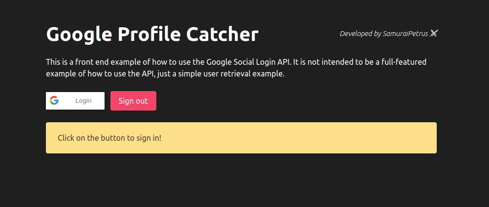

# Google Profile Catcher
</img>

A simple Node.js application created to get information relevant to backend integrations using Google's social login system.
## Prerequisites
I assume you have [Node.js](https://nodejs.org/en/download/) installed in your machine, if you don't, do it.
## Recommendations
Is recommended to read the official [Google Social Login documentation](https://developers.google.com/identity/sign-in/web/sign-in) before or while using this repository. But chill, it's just a friend's tip :smile:, you can completely ignore it.
## How to use
Replace the "content" attribute to your Google's project Client ID.
```html
<meta name="google-signin-client_id" content="YOUR-CLIENT-ID-GOES-HERE">
``` 
Run the application's server (the server.js file) with the command bellow, and access your local host in the listening port.
```shell
node server.js
```
You can optionally change this port if you already have something running on it, just change the "port" constant on the server.js file
```javascript
const port = 4000; //Ex: 9999
```

Then all you have to do is click on the "Login" button and then catch your info. :sunglasses:.

## Facing issues?
If you have issues related to the Google Social Login integration, i recommend again to read the docs on the "Recommendations" session.

Additionally, here's some valious tips
- Remember to add your localhost URL to the "Authorized JavaScript Origins" in your Google project, then restart your application, it should take some minutes to your permission error disappear.
- Feel free to open issues, or even pull requests to this repo. 😄

